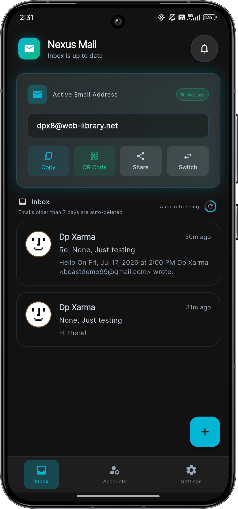
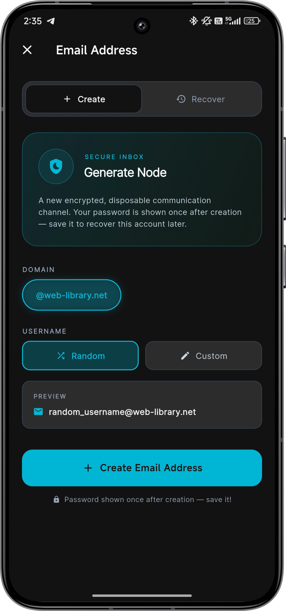
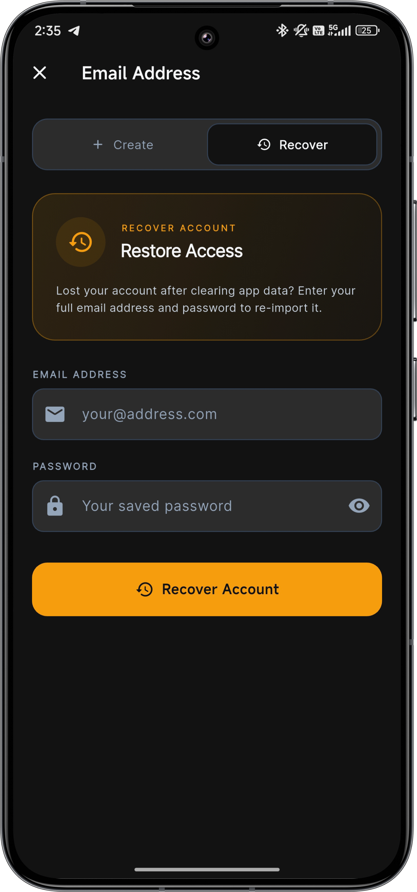
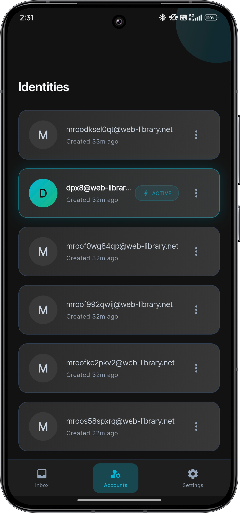
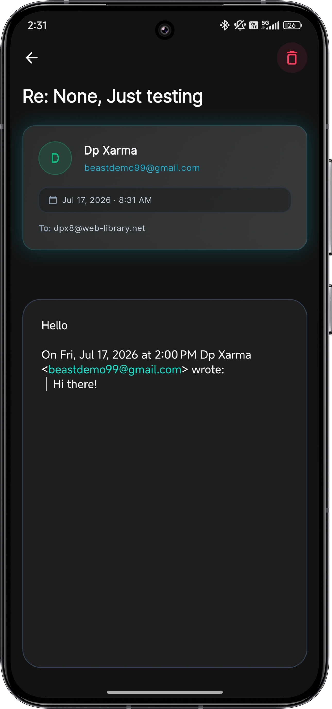
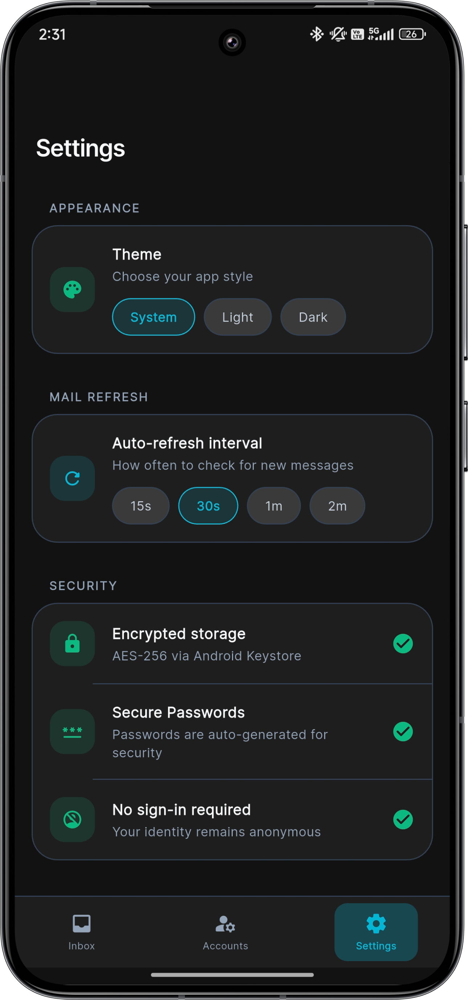

  
  
  <h1>Nexus Mail</h1>
  
<strong>A high-performance, secure, and modern temporary email client for Android.</strong>

  

    
    
    
    
  

 

Built with a focus on fluidity, privacy, and user experience, Nexus Mail allows users to instantly generate disposable identities to protect their personal inbox from spam, promotional clutter, and tracking.

## Features
- **Instant Identity Generation:** Create anonymous, temporary email addresses instantly with zero sign-up or personal information required.
- **Multi-Account Management:** Keep track of multiple disposable identities simultaneously. Easily switch between them with a single tap.
- **Real-Time Inbox:** Receive emails instantly. The inbox auto-refreshes seamlessly in the background to ensure you never miss a verification code or link.
- **Rich HTML Rendering:** Full support for HTML emails. Automated emails, newsletters, and OTPs are automatically scaled to fit perfectly on your mobile screen.
- **Privacy First:** Emails older than 7 days are automatically wiped from the server. You can also manually and permanently destroy any identity and its contents at any time.
- **Fluid User Interface:** Built with a premium, glass-morphism aesthetic and a deep dark mode, optimized specifically for high-refresh-rate 120Hz displays.

## Screenshots

  
  
  

 

  
  
  

## Direct Download
[Download Nexus Mail v1.0.0 APK](https://github.com/hunterdp11/nexus-mail-releases/releases/download/v1.0.0/app-arm64-v8a-release.apk)

## Credits & API Sources
Nexus Mail utilizes the following external APIs to provide secure temporary email generation and delivery:
- [Mail.gw](https://mail.gw/) - Core email infrastructure and domain management.
- [Mail.tm](https://mail.tm/) - Temporary email routing and retrieval.

Both services provide reliable and private backend infrastructure that powers Nexus Mail's disposable identities.